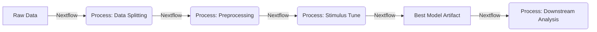

# DeepModelOptim (Nextflow)

**DeepModelOptim** refers to the overarching workflow where `stimulus-py` is orchestrated by **Nextflow** to perform large-scale, reproducible analysis.

While `stimulus-py` handles the "inner loop" (optimizing a single model architecture on a single dataset), Nextflow handles the "outer loop" (managing thousands of experiments, data versions, and parallel execution on HPCs/Clouds).

## The Pipeline Concept

In a DeepModelOptim pipeline, `stimulus-py` components become Nextflow processes.



### 1. Data Splitting Process

Nextflow can call `stimulus split` to prepare data partitions, ensuring every experiment downstream uses the exact same train/test split.

```groovy
process SplitData {
    input:
    path raw_data

    output:
    path "split_data"

    script:
    """
    stimulus split --input $raw_data --output-dir split_data
    """
}
```

### 2. Tuning Process

The heavy lifting happens here. Nextflow can spawn hundreds of these processes in parallel, exploring different model classes or datasets simultaneously.

```groovy
process TuneModel {
    input:
    path split_data
    path config_file

    output:
    path "output/best_model.pt"

    script:
    """
    stimulus tune --config $config_file --data-dir $split_data
    """
}
```

## Benefits of Integration

1.  **Scalability**: Nextflow handles job submission (slurm, k8s, AWS Batch). `stimulus-py` just sees a local GPU.
2.  **Reproducibility**: Nextflow tracks the exact version of the data and code used for every artifact.
3.  **Resumability**: If a run fails, Nextflow resumes from the last successful checkpoint.

By designing your model with `stimulus-py`'s standardized interface, you automatically unlock the ability to scale up via DeepModelOptim without changing a line of your model code.
